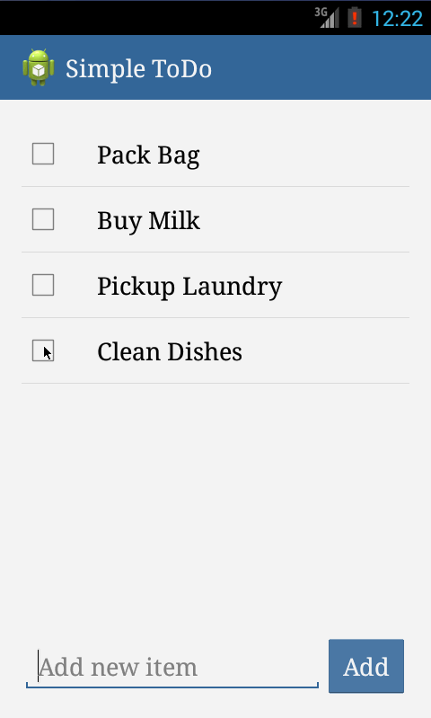

Simple Todo List - android app
================

Simple Todo List is a basic android app built as a prework for the Android bootcamp. The project was described on 

The app allows building a todo list and basic management functionality for todo items including add new, edit and delete an existing todo. The built app is an extension of basic app requested and includes the following functionality:

* [x]	User can view the list of all todo items (required). Only active todos are displayed as opposed to deleted or completed
* [x]	User can add a new todo item to the list by specify todo name and clicking “Add” button. If user tries to save a todo with blank name then message (toast) is displayed and nothing saved
* [x]	User can remove existing todo item from the list using long click. Todo is marked as deleted in DB and cleared from the list. User can not un-delete the deleted todo
* [x]	User can edit a todo item name. Todo list item click bring Edit Todo Name dialog. So user can edit and then cancel or save changes to the todo name. Saving blank name is not allowed. Clearing the name to blank will bring error message. If user tries to save an empty name then dialog will close and “not saved” message is displayed as toast.

The app was tested on HTC One (Android 4.1.2) and on android virtual devices.

Walkthrough of implemeted user stories:

GIF created with [LiceCap](http://www.cockos.com/licecap/).

The app is different from the basic spec in the following aspects:
-	Some basic theme changes (color, font)
-	AlertDialog fragment is used for todo editing in place of the second activity
-	Some basic validation and messaging is implemented (not blank name)
-	Custom ArrayList Adapter is used to populate todo items ListView. 
-	SQLite is used for persisting data

Points to consider for future development:
-	Fix issue with error message appearing while word is suggested with spell-check on.
-	Marking completion 
-	Setting priority
-	Change the item in ListView to display additional attributes, stylize the items
-	Improve look and feel

